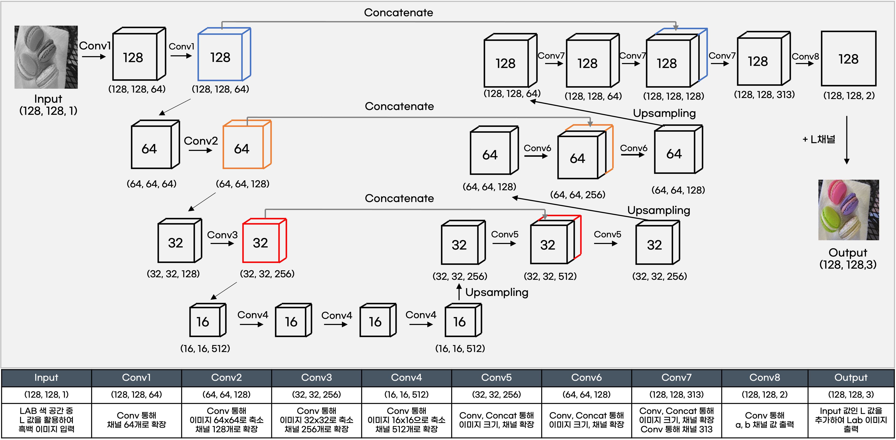

# JKSPNET - Pytorch - LAB

## 모델 정보

- 모델명 : JKSPNET
- 사용 라이브러리 : Pytorch
- 사용 색상모드 : LAB

<br/>

## 모델 설명


- Input 이미지로 흑백 이미지(128, 128, 1) 형태의 데이터를 활용.
- 최종 출력 값은 AB 값 (128, 128, 2) 형태의 데이터이며 여기에 Input 값을 L 값으로 추가하여 최종 컬러 이미지를 출력하는 구조. 
- 컨볼루션1 레이어에서는 가로 세로 128 픽셀의 이미지를 입력 받아 채널 수를 64로 확장. 
- 컨볼루션2와 3을 통해서는 이미지의 크기는 축소하고 채널수는 확장하는 과정을 계속 진행하여 이미지의 크기를 16,채널 수를 512로 확장. 
- 컨볼루션4에서는 채널 수를 유지하며 3차례 컨볼루션을 진행하며 이미지 구조를 학습. 
- 컨볼루션5 부터는 이미지의 크기는 확대하고 채널 수는 줄여나가는 과정을 진행. 
- 이때 이미지를 축소하며 학습했던 이미지와 확대하는 과정의 이미지를 결합한 데이터를 생성하고 이를 다시 컨볼루션하여 이미지의 구조를 학습. 
- 컨볼루션 6과 7에서 동일한 과정을 진행하며 가로 세로 크기 128, 128개의 채널을 가진 데이터를 생성합니다. 
- 채널 수는 ab 값의 쌍이며 ab 값은 L=50 일 때 313개의 쌍을 가질 수 있음. 
- 데이터 전처리 과정에서 L-50 으로 정규화를 진행했기 때문에, 이를 활용하여 마지막 채널 수를 313개로 늘려준 후 마지막 컨볼루션을 통해 ab 2개의 채널로 축소시키는 과정을 진행. 
- 이후 L 값을 추가하여 최종 컬러이미지를 출력.

<br/>

## 모델 구축 code

```Python
import torch
import torch.nn as nn
from torchinfo import summary

device = torch.device("cuda" if torch.cuda.is_available() else "cpu")

class JKPSNET(nn.Module) :
    def __init__(self) :
        super().__init__()
        
        def conv_2xs(in_dim, out_dim) :
            model = nn.Sequential(
                nn.Conv2d(in_dim, out_dim, kernel_size=3, stride=1, padding=1, bias=True),
                nn.ReLU(inplace=True),
                nn.Conv2d(out_dim, out_dim, kernel_size=3, stride=1, padding=1, bias=True),
                nn.ReLU(inplace=True),
                nn.BatchNorm2d(out_dim)
            )
            return model
        
        def conv_2x(in_dim, out_dim) :
            model = nn.Sequential(
                nn.Conv2d(in_dim, in_dim, kernel_size=3, stride=2, padding=1, bias=True),
                nn.ReLU(inplace=True),
                nn.Conv2d(in_dim, out_dim, kernel_size=3, stride=1, padding=1, bias=True),
                nn.ReLU(inplace=True),
                nn.Conv2d(out_dim, out_dim, kernel_size=3, stride=1, padding=1, bias=True),
                nn.ReLU(inplace=True),
                nn.BatchNorm2d(out_dim)
            )
            return model
        
        def conv_3xdil(dim) :
            model = nn.Sequential(
                nn.Conv2d(dim, dim, kernel_size=3, dilation=2, stride=1, padding=2, bias=True),
                nn.ReLU(inplace=True),
                nn.Conv2d(dim, dim, kernel_size=3, dilation=2, stride=1, padding=2, bias=True),
                nn.ReLU(inplace=True),
                nn.Conv2d(dim, dim, kernel_size=3, dilation=2, stride=1, padding=2, bias=True),
                nn.ReLU(inplace=True),
                nn.BatchNorm2d(dim)
            )
            return model
        
        def conv_up(in_dim, out_dim) :
            model = nn.Sequential(
                nn.Conv2d(in_dim, out_dim, kernel_size=3, stride=1, padding=1, bias=True),
                nn.ReLU(inplace=True),
                nn.Conv2d(out_dim, out_dim, kernel_size=3, stride=1, padding=1, bias=True),
                nn.ReLU(inplace=True),
                nn.BatchNorm2d(out_dim)
            )
            return model
        
        self.input = nn.Sequential()
        self.enc1 = conv_2xs(1, 64)
        self.enc2 = conv_2x(64, 128)
        self.enc3 = conv_2x(128, 256)
        self.enc4 = conv_2x(256, 512)
        self.convR = nn.Sequential(conv_3xdil(512))
       
        
        self.ups1 = nn.ConvTranspose2d(512, 256, kernel_size=4, stride=2, padding=1, bias=True)
        self.dec1 = conv_up(512, 256)
        self.ups2 = nn.ConvTranspose2d(256, 128, kernel_size=4, stride=2, padding=1, bias=True)
        self.dec2 = conv_up(256, 128)
        self.ups3 = nn.ConvTranspose2d(128, 64, kernel_size=4, stride=2, padding=1, bias=True)
        self.dec3 = conv_up(128, 64)

        self.abp = nn.Conv2d(64, 313, kernel_size=1, stride=1, padding=0, bias=True)
        self.softmax = nn.Softmax(dim=1)
        
        self.out = nn.Conv2d(313, 2, kernel_size=1, padding=0, dilation=1, stride=1, bias=False)
        
        self.print_cat = nn.Sequential()
        
        
        
    def forward(self, x):
        x = self.input(x)
        x1 = self.enc1(x)
        x2 = self.enc2(x1)
        x3 = self.enc3(x2)
        x = self.enc4(x3)
        x = self.convR(x)
        
        x = self.ups1(x)
        x = self.print_cat(torch.cat([x, x3], dim = 1))
        x = self.dec1(x)
        x = self.ups2(x)
        x = self.print_cat(torch.cat([x, x2], dim = 1))
        x = self.dec2(x)
        x = self.ups3(x)
        x = self.print_cat(torch.cat([x, x1], dim = 1))
        x = self.dec3(x)
        
        x = self.abp(x)
        
        x = self.out(self.softmax(x))
        
        
        return x

model_JKPSNET = JKPSNET().to(device)
```

<br/>

## 모델 Summary

```
==========================================================================================
Layer (type:depth-idx)                   Output Shape              Param #
==========================================================================================
JKPSNET                                  --                        --
├─Sequential: 1-1                        [32, 1, 128, 128]         --
├─Sequential: 1-2                        [32, 64, 128, 128]        --
│    └─Conv2d: 2-1                       [32, 64, 128, 128]        640
│    └─ReLU: 2-2                         [32, 64, 128, 128]        --
│    └─Conv2d: 2-3                       [32, 64, 128, 128]        36,928
│    └─ReLU: 2-4                         [32, 64, 128, 128]        --
│    └─BatchNorm2d: 2-5                  [32, 64, 128, 128]        128
├─Sequential: 1-3                        [32, 128, 64, 64]         --
│    └─Conv2d: 2-6                       [32, 64, 64, 64]          36,928
│    └─ReLU: 2-7                         [32, 64, 64, 64]          --
│    └─Conv2d: 2-8                       [32, 128, 64, 64]         73,856
│    └─ReLU: 2-9                         [32, 128, 64, 64]         --
│    └─Conv2d: 2-10                      [32, 128, 64, 64]         147,584
│    └─ReLU: 2-11                        [32, 128, 64, 64]         --
│    └─BatchNorm2d: 2-12                 [32, 128, 64, 64]         256
├─Sequential: 1-4                        [32, 256, 32, 32]         --
│    └─Conv2d: 2-13                      [32, 128, 32, 32]         147,584
│    └─ReLU: 2-14                        [32, 128, 32, 32]         --
│    └─Conv2d: 2-15                      [32, 256, 32, 32]         295,168
│    └─ReLU: 2-16                        [32, 256, 32, 32]         --
│    └─Conv2d: 2-17                      [32, 256, 32, 32]         590,080
│    └─ReLU: 2-18                        [32, 256, 32, 32]         --
│    └─BatchNorm2d: 2-19                 [32, 256, 32, 32]         512
├─Sequential: 1-5                        [32, 512, 16, 16]         --
│    └─Conv2d: 2-20                      [32, 256, 16, 16]         590,080
│    └─ReLU: 2-21                        [32, 256, 16, 16]         --
│    └─Conv2d: 2-22                      [32, 512, 16, 16]         1,180,160
│    └─ReLU: 2-23                        [32, 512, 16, 16]         --
│    └─Conv2d: 2-24                      [32, 512, 16, 16]         2,359,808
│    └─ReLU: 2-25                        [32, 512, 16, 16]         --
│    └─BatchNorm2d: 2-26                 [32, 512, 16, 16]         1,024
├─Sequential: 1-6                        [32, 512, 16, 16]         --
│    └─Sequential: 2-27                  [32, 512, 16, 16]         --
│    │    └─Conv2d: 3-1                  [32, 512, 16, 16]         2,359,808
│    │    └─ReLU: 3-2                    [32, 512, 16, 16]         --
│    │    └─Conv2d: 3-3                  [32, 512, 16, 16]         2,359,808
│    │    └─ReLU: 3-4                    [32, 512, 16, 16]         --
│    │    └─Conv2d: 3-5                  [32, 512, 16, 16]         2,359,808
│    │    └─ReLU: 3-6                    [32, 512, 16, 16]         --
│    │    └─BatchNorm2d: 3-7             [32, 512, 16, 16]         1,024
├─ConvTranspose2d: 1-7                   [32, 256, 32, 32]         2,097,408
├─Sequential: 1-8                        [32, 512, 32, 32]         --
├─Sequential: 1-9                        [32, 256, 32, 32]         --
│    └─Conv2d: 2-28                      [32, 256, 32, 32]         1,179,904
│    └─ReLU: 2-29                        [32, 256, 32, 32]         --
│    └─Conv2d: 2-30                      [32, 256, 32, 32]         590,080
│    └─ReLU: 2-31                        [32, 256, 32, 32]         --
│    └─BatchNorm2d: 2-32                 [32, 256, 32, 32]         512
├─ConvTranspose2d: 1-10                  [32, 128, 64, 64]         524,416
├─Sequential: 1-11                       [32, 256, 64, 64]         --
├─Sequential: 1-12                       [32, 128, 64, 64]         --
│    └─Conv2d: 2-33                      [32, 128, 64, 64]         295,040
│    └─ReLU: 2-34                        [32, 128, 64, 64]         --
│    └─Conv2d: 2-35                      [32, 128, 64, 64]         147,584
│    └─ReLU: 2-36                        [32, 128, 64, 64]         --
│    └─BatchNorm2d: 2-37                 [32, 128, 64, 64]         256
├─ConvTranspose2d: 1-13                  [32, 64, 128, 128]        131,136
├─Sequential: 1-14                       [32, 128, 128, 128]       --
├─Sequential: 1-15                       [32, 64, 128, 128]        --
│    └─Conv2d: 2-38                      [32, 64, 128, 128]        73,792
│    └─ReLU: 2-39                        [32, 64, 128, 128]        --
│    └─Conv2d: 2-40                      [32, 64, 128, 128]        36,928
│    └─ReLU: 2-41                        [32, 64, 128, 128]        --
│    └─BatchNorm2d: 2-42                 [32, 64, 128, 128]        128
├─Conv2d: 1-16                           [32, 313, 128, 128]       20,345
├─Softmax: 1-17                          [32, 313, 128, 128]       --
├─Conv2d: 1-18                           [32, 2, 128, 128]         626
==========================================================================================
Total params: 17,639,339
Trainable params: 17,639,339
Non-trainable params: 0
Total mult-adds (G): 570.51
==========================================================================================
Input size (MB): 2.10
Forward/backward pass size (MB): 4961.86
Params size (MB): 70.56
Estimated Total Size (MB): 5034.52
==========================================================================================
```
