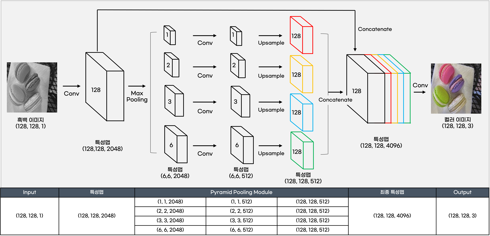

# colorization-Keras-PSPNET

## 모델 정보

- 모델명 : PSPNET
- 사용 라이브러리 : TensorFlow-Keras
- 사용 색상모드 : RGB

<br/>

## 모델 설명



- PSPNET은 피라미드 풀링이라는 기법을 사용하는 CNN 모델.
- 1채널의 흑백 이미지를 입력 받아 초기에 합성곱을 통해 2048개로 채널 수를 늘림.
- 이후 같은 채널 수의 특성맵을 4개 만들어 이를 각각 합성곱을 통해 512개의 채널 수를 갖는 이미지로 만들어줌.
- 초기의 2048개 채널 이미지와 4개의 512개 채널 이미지를 모두 결합시켜 4096 채널의 특성맵으로 만든 후 이를 3채널로 만들어 출력.

<br/>

## 모델 구축 code

```Python
from tensorflow.keras import models, backend
from tensorflow.keras.layers import Input, Conv2D, AveragePooling2D, BatchNormalization, Activation, UpSampling2D, Concatenate
from tensorflow.keras.models import Model
from tensorflow.keras.optimizers import Adam

def PSPNET(org_shape, n_ch) :
    
    img_size = org_shape[0]
    kernel_size_list = [1, 2, 4, 8]
    chennel_num = 128
    layer_num = 4
    layer_chennel_num = int(chennel_num/layer_num)
    
    inputs = Input(shape=org_shape)
    
    x = Conv2D(chennel_num, kernel_size=1)(inputs)
    
    x1 = AveragePooling2D(int(img_size/kernel_size_list[0]))(x)
    x1 = Conv2D(layer_chennel_num,kernel_size=1)(x1)
    x1 = BatchNormalization()(x1)
    x1 = Activation('relu')(x1)
    x1 = UpSampling2D(int(img_size/kernel_size_list[0]), interpolation='bilinear')(x1)
    
    x2 = AveragePooling2D(int(img_size/kernel_size_list[1]))(x)
    x2 = Conv2D(layer_chennel_num,kernel_size=1)(x2)
    x2 = BatchNormalization()(x2)
    x2 = Activation('relu')(x2)
    x2 = UpSampling2D(int(img_size/kernel_size_list[1]), interpolation='bilinear')(x2)
    
    x3 = AveragePooling2D(int(img_size/kernel_size_list[2]))(x)
    x3 = Conv2D(layer_chennel_num,kernel_size=1)(x3)
    x3 = BatchNormalization()(x3)
    x3 = Activation('relu')(x3)
    x3 = UpSampling2D(int(img_size/kernel_size_list[2]), interpolation='bilinear')(x3)
    
    x4 = AveragePooling2D(int(img_size/kernel_size_list[3]))(x)
    x4 = Conv2D(layer_chennel_num,kernel_size=1)(x4)   
    x4 = BatchNormalization()(x4)
    x4 = Activation('relu')(x4)
    x4 = UpSampling2D(int(img_size/kernel_size_list[3]), interpolation='bilinear')(x4)
    
    x = Concatenate(axis=-1)([x, x1, x2, x3, x4])
    #print(np.shape(x))
    outputs = Conv2D(n_ch, kernel_size=1)(x)
    
    model = Model(inputs=inputs, outputs=outputs)
    
    optimizer = Adam(lr=0.001)
        
    model.compile(loss='mse', optimizer=optimizer, metrics=['acc'])
    
    return model

pspnet = PSPNET(data_train.input_shape, data_train.n_ch)
```

<br/>

## 모델 Summary

```
Model: "PSPNET_TensorFlow-Keras"
__________________________________________________________________________________________________
Layer (type)                    Output Shape         Param #     Connected to                     
==================================================================================================
input_1 (InputLayer)            [(None, 128, 128, 1) 0                                            
__________________________________________________________________________________________________
conv2d (Conv2D)                 (None, 128, 128, 128 256         input_1[0][0]                    
__________________________________________________________________________________________________
average_pooling2d (AveragePooli (None, 1, 1, 128)    0           conv2d[0][0]                     
__________________________________________________________________________________________________
average_pooling2d_1 (AveragePoo (None, 2, 2, 128)    0           conv2d[0][0]                     
__________________________________________________________________________________________________
average_pooling2d_2 (AveragePoo (None, 4, 4, 128)    0           conv2d[0][0]                     
__________________________________________________________________________________________________
average_pooling2d_3 (AveragePoo (None, 8, 8, 128)    0           conv2d[0][0]                     
__________________________________________________________________________________________________
conv2d_1 (Conv2D)               (None, 1, 1, 32)     4128        average_pooling2d[0][0]          
__________________________________________________________________________________________________
conv2d_2 (Conv2D)               (None, 2, 2, 32)     4128        average_pooling2d_1[0][0]        
__________________________________________________________________________________________________
conv2d_3 (Conv2D)               (None, 4, 4, 32)     4128        average_pooling2d_2[0][0]        
__________________________________________________________________________________________________
conv2d_4 (Conv2D)               (None, 8, 8, 32)     4128        average_pooling2d_3[0][0]        
__________________________________________________________________________________________________
batch_normalization (BatchNorma (None, 1, 1, 32)     128         conv2d_1[0][0]                   
__________________________________________________________________________________________________
batch_normalization_1 (BatchNor (None, 2, 2, 32)     128         conv2d_2[0][0]                   
__________________________________________________________________________________________________
batch_normalization_2 (BatchNor (None, 4, 4, 32)     128         conv2d_3[0][0]                   
__________________________________________________________________________________________________
batch_normalization_3 (BatchNor (None, 8, 8, 32)     128         conv2d_4[0][0]                   
__________________________________________________________________________________________________
activation (Activation)         (None, 1, 1, 32)     0           batch_normalization[0][0]        
__________________________________________________________________________________________________
activation_1 (Activation)       (None, 2, 2, 32)     0           batch_normalization_1[0][0]      
__________________________________________________________________________________________________
activation_2 (Activation)       (None, 4, 4, 32)     0           batch_normalization_2[0][0]      
__________________________________________________________________________________________________
activation_3 (Activation)       (None, 8, 8, 32)     0           batch_normalization_3[0][0]      
__________________________________________________________________________________________________
up_sampling2d (UpSampling2D)    (None, 128, 128, 32) 0           activation[0][0]                 
__________________________________________________________________________________________________
up_sampling2d_1 (UpSampling2D)  (None, 128, 128, 32) 0           activation_1[0][0]               
__________________________________________________________________________________________________
up_sampling2d_2 (UpSampling2D)  (None, 128, 128, 32) 0           activation_2[0][0]               
__________________________________________________________________________________________________
up_sampling2d_3 (UpSampling2D)  (None, 128, 128, 32) 0           activation_3[0][0]               
__________________________________________________________________________________________________
concatenate (Concatenate)       (None, 128, 128, 256 0           conv2d[0][0]                     
                                                                 up_sampling2d[0][0]              
                                                                 up_sampling2d_1[0][0]            
                                                                 up_sampling2d_2[0][0]            
                                                                 up_sampling2d_3[0][0]            
__________________________________________________________________________________________________
conv2d_5 (Conv2D)               (None, 128, 128, 3)  771         concatenate[0][0]                
==================================================================================================
Total params: 18,051
Trainable params: 17,795
Non-trainable params: 256
__________________________________________________________________________________________________
```
