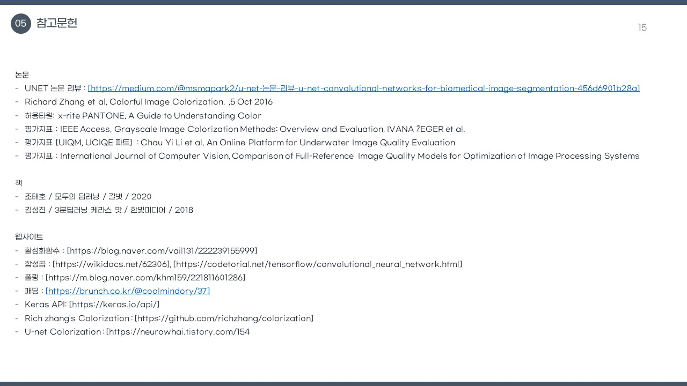

# Colorization-DLProject
홍익대학교 산업공학과 졸업프로젝트 (2학기) - 딥러닝을 활용하여 컬러 변환 모델 구현

## 🧑‍💻 프로젝트 팀원
- 김민기
- 박승진
- 손예준
- 장우재

 

## 📄 프로젝트 개요
- 해당 프로젝트는 4학년 2학기에 실시하는 졸업프로젝트로 과목명은 '시스템설계' 이다.
- 프로젝트 주제 : AI를 활용한 흑백 이미지 컬러변환
- 프로젝트 기간 : 2021-07-01 ~ 2021-12-07
- 프로젝트 진행 방법 : 
    - 관련 논문을 분석하고 모델을 구현.
    - 구현한 모델을 활용하여 JKSPNET 이라는 자체 모델을 개발.

 

## 💿 논문 모델 구현
- [UNET - TensorFlow-keras - RGB](./UNET-TensorFlow/)
- [UNET - Pytorch - RGB](./UNET-Pytorch-RGB/)
- [UNET - Pytorch - LAB](./UNET-Pytorch-LAB/)
- [PSPNET - TensorFlow-keras - RGB](./PSPNET/)

 

## 🔨 자체 모델 개발
- [JKSPNET - Pytorch - LAB](./JKSPNET/)

 

## 🎥 프로젝트 발표 영상

 

## 🎤 프로젝트 발표 PPT

## ❗ 소감
- Pytorch를 활용한 모델 개발 역량을 키울 수 있어 만족스러웠다.
- 기존 모델과 비교시 약간의 성능 향상을 확인하 수 있어 만족스러웠다.
- 2학기에 주제를 바꾸게 되어 연구 기간이 짧아 많이 아쉬웠다.

 

## 💔 아쉬운 점 & 개선 사항
- 복원된 이미지를 평가하는 부분에 대한 조사가 부족하였다.
- 128x128 픽셀의 작은 이미지만 복원이 가능했다.
- 다양한 이미지를 복원하는 방법에 대한 연구가 필요하다.
- 대용량 이미지 데이터를 관리하고 처리하는 방법에 대한 공부가 필요하다.
