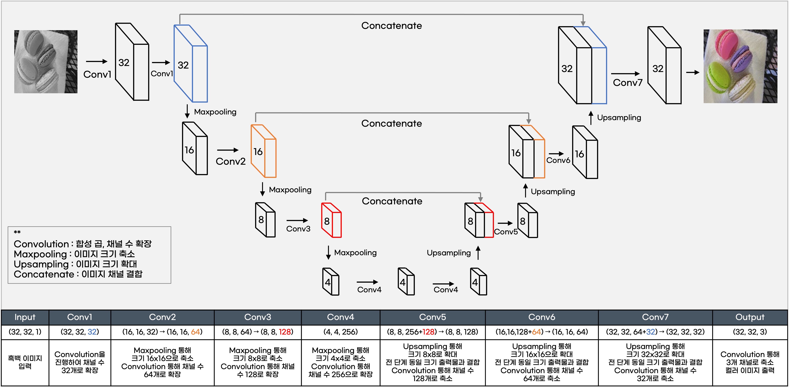

# UNET - Pytorch - RGB

## 모델 정보
- 모델명 : UNET
- 사용 라이브러리 : Pytorch
- 사용 색상모드 : RGB

<br/>

## 모델 설명

- 이미지가 수축, 확장되는 과정을 도식화 하면 U자 모양이기에 UNET이라는 이름이 붙여짐.
- 1채널의 흑백 이미지를 입력 받아 컨볼루션, 합성곱을 통해 채널 수를 32, 64, 128, 256 으로 늘려가고 이미지의 크기는 축소시킴.
- 이후 Upsampling을 통해 이미지의 크기는 확대, 채널 수는 축소시키는 과정에서 같은 크기의 이미지끼리 결합시키는 concatenate을 통해 최대한 많은 특성맵을 학습함.
- 결과값으로 3개의 채널을 가지는 컬러 이미지를 출력.

<br/>

## 모델 구축 code
```Python
import torch
import torch.nn as nn
from torchinfo import summary

device = torch.device("cuda" if torch.cuda.is_available() else "cpu")

class UNET(nn.Module) :
    def __init__(self) :
        super().__init__()
        
        def conv(in_dim, out_dim) :
            model = nn.Sequential(
                nn.Conv2d(in_dim, out_dim, kernel_size=3, padding='same'),
                nn.BatchNorm2d(out_dim),
                nn.ReLU(inplace=True),
                nn.Conv2d(out_dim, out_dim, kernel_size=3, padding='same'),
                nn.BatchNorm2d(out_dim),
                nn.ReLU(inplace=True)
            )
            return model
        
        def max_pool() :
            model = nn.MaxPool2d(2)
            return model
        
        def up_conv(in_dim, out_dim) :
            model = nn.Sequential(
                nn.Upsample(scale_factor=2, mode='bilinear', align_corners=True),
                nn.Conv2d(in_dim, out_dim, kernel_size=2, padding='same')
            )
            return model
        
        self.input = nn.Sequential()
        self.enc1 = conv(1, 64)
        self.enc2 = nn.Sequential(max_pool(), conv(64, 128))
        self.enc3 = nn.Sequential(max_pool(), conv(128, 256))
        self.enc4 = nn.Sequential(max_pool(), conv(256, 512))
        self.enc5 = nn.Sequential(max_pool(), conv(512, 1024))
        
        self.dec1 = up_conv(1024, 512)
        self.dec2 = nn.Sequential(conv(1024, 512), up_conv(512, 256))
        self.dec3 = nn.Sequential(conv(512, 256), up_conv(256, 128))
        self.dec4 = nn.Sequential(conv(256, 128), up_conv(128, 64))
        self.dec5 = conv(128, 64)
        self.out = nn.Conv2d(64, 3, kernel_size=1, padding = 'same')
        
        
        
    def forward(self, x):
        x = self.input(x)
        x1 = self.enc1(x)
        x2 = self.enc2(x1)
        x3 = self.enc3(x2)
        x4 = self.enc4(x3)
        x5 = self.enc5(x4)
        
        x = self.dec1(x5)
        x = torch.cat([x, x4], dim = 1)
        x = self.dec2(x)
        x = torch.cat([x, x3], dim = 1)
        x = self.dec3(x)
        x = torch.cat([x, x2], dim = 1)
        x = self.dec4(x)
        x = torch.cat([x, x1], dim = 1)
        x = self.dec5(x)
        x = self.out(x)
        
        
        return x

model_UNET = UNET().to(device)
```

<br/>

## 모델 Summary
```
==========================================================================================
Layer (type:depth-idx)                   Output Shape              Param #
==========================================================================================
UNET                                     --                        --
├─Sequential: 1-1                        [32, 1, 128, 128]         --
├─Sequential: 1-2                        [32, 64, 128, 128]        --
│    └─Conv2d: 2-1                       [32, 64, 128, 128]        640
│    └─BatchNorm2d: 2-2                  [32, 64, 128, 128]        128
│    └─ReLU: 2-3                         [32, 64, 128, 128]        --
│    └─Conv2d: 2-4                       [32, 64, 128, 128]        36,928
│    └─BatchNorm2d: 2-5                  [32, 64, 128, 128]        128
│    └─ReLU: 2-6                         [32, 64, 128, 128]        --
├─Sequential: 1-3                        [32, 128, 64, 64]         --
│    └─MaxPool2d: 2-7                    [32, 64, 64, 64]          --
│    └─Sequential: 2-8                   [32, 128, 64, 64]         --
│    │    └─Conv2d: 3-1                  [32, 128, 64, 64]         73,856
│    │    └─BatchNorm2d: 3-2             [32, 128, 64, 64]         256
│    │    └─ReLU: 3-3                    [32, 128, 64, 64]         --
│    │    └─Conv2d: 3-4                  [32, 128, 64, 64]         147,584
│    │    └─BatchNorm2d: 3-5             [32, 128, 64, 64]         256
│    │    └─ReLU: 3-6                    [32, 128, 64, 64]         --
├─Sequential: 1-4                        [32, 256, 32, 32]         --
│    └─MaxPool2d: 2-9                    [32, 128, 32, 32]         --
│    └─Sequential: 2-10                  [32, 256, 32, 32]         --
│    │    └─Conv2d: 3-7                  [32, 256, 32, 32]         295,168
│    │    └─BatchNorm2d: 3-8             [32, 256, 32, 32]         512
│    │    └─ReLU: 3-9                    [32, 256, 32, 32]         --
│    │    └─Conv2d: 3-10                 [32, 256, 32, 32]         590,080
│    │    └─BatchNorm2d: 3-11            [32, 256, 32, 32]         512
│    │    └─ReLU: 3-12                   [32, 256, 32, 32]         --
├─Sequential: 1-5                        [32, 512, 16, 16]         --
│    └─MaxPool2d: 2-11                   [32, 256, 16, 16]         --
│    └─Sequential: 2-12                  [32, 512, 16, 16]         --
│    │    └─Conv2d: 3-13                 [32, 512, 16, 16]         1,180,160
│    │    └─BatchNorm2d: 3-14            [32, 512, 16, 16]         1,024
│    │    └─ReLU: 3-15                   [32, 512, 16, 16]         --
│    │    └─Conv2d: 3-16                 [32, 512, 16, 16]         2,359,808
│    │    └─BatchNorm2d: 3-17            [32, 512, 16, 16]         1,024
│    │    └─ReLU: 3-18                   [32, 512, 16, 16]         --
├─Sequential: 1-6                        [32, 1024, 8, 8]          --
│    └─MaxPool2d: 2-13                   [32, 512, 8, 8]           --
│    └─Sequential: 2-14                  [32, 1024, 8, 8]          --
│    │    └─Conv2d: 3-19                 [32, 1024, 8, 8]          4,719,616
│    │    └─BatchNorm2d: 3-20            [32, 1024, 8, 8]          2,048
│    │    └─ReLU: 3-21                   [32, 1024, 8, 8]          --
│    │    └─Conv2d: 3-22                 [32, 1024, 8, 8]          9,438,208
│    │    └─BatchNorm2d: 3-23            [32, 1024, 8, 8]          2,048
│    │    └─ReLU: 3-24                   [32, 1024, 8, 8]          --
├─Sequential: 1-7                        [32, 512, 16, 16]         --
│    └─Upsample: 2-15                    [32, 1024, 16, 16]        --
│    └─Conv2d: 2-16                      [32, 512, 16, 16]         2,097,664
├─Sequential: 1-8                        [32, 256, 32, 32]         --
│    └─Sequential: 2-17                  [32, 512, 16, 16]         --
│    │    └─Conv2d: 3-25                 [32, 512, 16, 16]         4,719,104
│    │    └─BatchNorm2d: 3-26            [32, 512, 16, 16]         1,024
│    │    └─ReLU: 3-27                   [32, 512, 16, 16]         --
│    │    └─Conv2d: 3-28                 [32, 512, 16, 16]         2,359,808
│    │    └─BatchNorm2d: 3-29            [32, 512, 16, 16]         1,024
│    │    └─ReLU: 3-30                   [32, 512, 16, 16]         --
│    └─Sequential: 2-18                  [32, 256, 32, 32]         --
│    │    └─Upsample: 3-31               [32, 512, 32, 32]         --
│    │    └─Conv2d: 3-32                 [32, 256, 32, 32]         524,544
├─Sequential: 1-9                        [32, 128, 64, 64]         --
│    └─Sequential: 2-19                  [32, 256, 32, 32]         --
│    │    └─Conv2d: 3-33                 [32, 256, 32, 32]         1,179,904
│    │    └─BatchNorm2d: 3-34            [32, 256, 32, 32]         512
│    │    └─ReLU: 3-35                   [32, 256, 32, 32]         --
│    │    └─Conv2d: 3-36                 [32, 256, 32, 32]         590,080
│    │    └─BatchNorm2d: 3-37            [32, 256, 32, 32]         512
│    │    └─ReLU: 3-38                   [32, 256, 32, 32]         --
│    └─Sequential: 2-20                  [32, 128, 64, 64]         --
│    │    └─Upsample: 3-39               [32, 256, 64, 64]         --
│    │    └─Conv2d: 3-40                 [32, 128, 64, 64]         131,200
├─Sequential: 1-10                       [32, 64, 128, 128]        --
│    └─Sequential: 2-21                  [32, 128, 64, 64]         --
│    │    └─Conv2d: 3-41                 [32, 128, 64, 64]         295,040
│    │    └─BatchNorm2d: 3-42            [32, 128, 64, 64]         256
│    │    └─ReLU: 3-43                   [32, 128, 64, 64]         --
│    │    └─Conv2d: 3-44                 [32, 128, 64, 64]         147,584
│    │    └─BatchNorm2d: 3-45            [32, 128, 64, 64]         256
│    │    └─ReLU: 3-46                   [32, 128, 64, 64]         --
│    └─Sequential: 2-22                  [32, 64, 128, 128]        --
│    │    └─Upsample: 3-47               [32, 128, 128, 128]       --
│    │    └─Conv2d: 3-48                 [32, 64, 128, 128]        32,832
├─Sequential: 1-11                       [32, 64, 128, 128]        --
│    └─Conv2d: 2-23                      [32, 64, 128, 128]        73,792
│    └─BatchNorm2d: 2-24                 [32, 64, 128, 128]        128
│    └─ReLU: 2-25                        [32, 64, 128, 128]        --
│    └─Conv2d: 2-26                      [32, 64, 128, 128]        36,928
│    └─BatchNorm2d: 2-27                 [32, 64, 128, 128]        128
│    └─ReLU: 2-28                        [32, 64, 128, 128]        --
├─Conv2d: 1-12                           [32, 3, 128, 128]         195
==========================================================================================
Total params: 31,042,499
Trainable params: 31,042,499
Non-trainable params: 0
Total mult-adds (G): 436.66
==========================================================================================
Input size (MB): 2.10
Forward/backward pass size (MB): 4609.54
Params size (MB): 124.17
Estimated Total Size (MB): 4735.81
==========================================================================================
```
