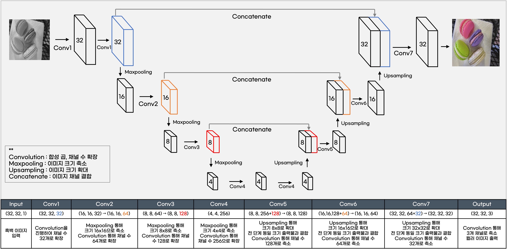

# UNET - TensorFlow-keras - RGB

## 모델 정보

- 모델명 : UNET
- 사용 라이브러리 : TensorFlow-Keras
- 사용 색상모드 : RGB

<br/>

## 모델 설명



- 이미지가 수축, 확장되는 과정을 도식화 하면 U자 모양이기에 UNET이라는 이름이 붙여짐.
- 1채널의 흑백 이미지를 입력 받아 컨볼루션, 합성곱을 통해 채널 수를 32, 64, 128, 256 으로 늘려가고 이미지의 크기는 축소시킴.
- 이후 Upsampling을 통해 이미지의 크기는 확대, 채널 수는 축소시키는 과정에서 같은 크기의 이미지끼리 결합시키는 concatenate을 통해 최대한 많은 특성맵을 학습함.
- 결과값으로 3개의 채널을 가지는 컬러 이미지를 출력.

<br/>

## 모델 구축 code

```Python
from tensorflow.keras import models, backend
from tensorflow.keras.layers import Input, Conv2D, MaxPooling2D, Dropout, UpSampling2D, BatchNormalization, Concatenate, Activation
from tensorflow.keras.models import Model
from tensorflow.keras.optimizers import Adam

def conv(x, n_f, mp_flag=True):
    x = MaxPooling2D((2, 2), padding='same')(x) if mp_flag else x
    x = Conv2D(n_f, (3, 3), padding='same')(x)
    x = BatchNormalization()(x)
    x = Activation('relu')(x)
    x = Dropout(0.05)(x)
    x = Conv2D(n_f, (3, 3), padding='same')(x)
    x = BatchNormalization()(x)
    x = Activation('relu')(x)
    return x

def deconv_unet(x, e, n_f, ic):
    x = UpSampling2D((2, 2))(x)
    x = Conv2D(n_f, (2, 2), padding='same')(x)
    x = Concatenate(axis=ic)([x, e])
    x = Conv2D(n_f, (3, 3), padding='same')(x)
    x = BatchNormalization()(x)
    x = Activation('relu')(x)
    x = Conv2D(n_f, (3, 3), padding='same')(x)
    x = BatchNormalization()(x)
    x = Activation('relu')(x)
    return x

def UNET(org_shape, n_ch):
    ic = 3 if backend.image_data_format() == 'channels_last' else 1
    # Input
    original = Input(shape=org_shape)

    # Encoding
    e1 = conv(original, 64, mp_flag=False)
    e2 = conv(e1, 128)
    e3 = conv(e2, 256)
    e4 = conv(e3, 512)

    encoded = conv(e4, 1024)

    # Decoding
    x = deconv_unet(encoded, e4, 512, ic)
    x = deconv_unet(x, e3, 256, ic)
    x = deconv_unet(x, e2, 128, ic)
    x = deconv_unet(x, e1, 64, ic)

    decoded = Conv2D(n_ch, (1, 1), padding='same')(x)


    model = Model(inputs=original, outputs=decoded)
    optimizer = Adam(lr=0.001)

    model.compile(loss='mse', optimizer=optimizer, metrics=['acc'])

    return model

unet = UNET(data_train.input_shape, data_train.n_ch)
```

<br/>

## 모델 Summary

```
Model: "UNET_TensorFlow-Keras_RGB_img-20000_resize-128"
__________________________________________________________________________________________________
Layer (type)                    Output Shape         Param #     Connected to                     
==================================================================================================
input_1 (InputLayer)            [(None, 128, 128, 1) 0                                            
__________________________________________________________________________________________________
conv2d (Conv2D)                 (None, 128, 128, 64) 640         input_1[0][0]                    
__________________________________________________________________________________________________
batch_normalization (BatchNorma (None, 128, 128, 64) 256         conv2d[0][0]                     
__________________________________________________________________________________________________
activation (Activation)         (None, 128, 128, 64) 0           batch_normalization[0][0]        
__________________________________________________________________________________________________
dropout (Dropout)               (None, 128, 128, 64) 0           activation[0][0]                 
__________________________________________________________________________________________________
conv2d_1 (Conv2D)               (None, 128, 128, 64) 36928       dropout[0][0]                    
__________________________________________________________________________________________________
batch_normalization_1 (BatchNor (None, 128, 128, 64) 256         conv2d_1[0][0]                   
__________________________________________________________________________________________________
activation_1 (Activation)       (None, 128, 128, 64) 0           batch_normalization_1[0][0]      
__________________________________________________________________________________________________
max_pooling2d (MaxPooling2D)    (None, 64, 64, 64)   0           activation_1[0][0]               
__________________________________________________________________________________________________
conv2d_2 (Conv2D)               (None, 64, 64, 128)  73856       max_pooling2d[0][0]              
__________________________________________________________________________________________________
batch_normalization_2 (BatchNor (None, 64, 64, 128)  512         conv2d_2[0][0]                   
__________________________________________________________________________________________________
activation_2 (Activation)       (None, 64, 64, 128)  0           batch_normalization_2[0][0]      
__________________________________________________________________________________________________
dropout_1 (Dropout)             (None, 64, 64, 128)  0           activation_2[0][0]               
__________________________________________________________________________________________________
conv2d_3 (Conv2D)               (None, 64, 64, 128)  147584      dropout_1[0][0]                  
__________________________________________________________________________________________________
batch_normalization_3 (BatchNor (None, 64, 64, 128)  512         conv2d_3[0][0]                   
__________________________________________________________________________________________________
activation_3 (Activation)       (None, 64, 64, 128)  0           batch_normalization_3[0][0]      
__________________________________________________________________________________________________
max_pooling2d_1 (MaxPooling2D)  (None, 32, 32, 128)  0           activation_3[0][0]               
__________________________________________________________________________________________________
conv2d_4 (Conv2D)               (None, 32, 32, 256)  295168      max_pooling2d_1[0][0]            
__________________________________________________________________________________________________
batch_normalization_4 (BatchNor (None, 32, 32, 256)  1024        conv2d_4[0][0]                   
__________________________________________________________________________________________________
activation_4 (Activation)       (None, 32, 32, 256)  0           batch_normalization_4[0][0]      
__________________________________________________________________________________________________
dropout_2 (Dropout)             (None, 32, 32, 256)  0           activation_4[0][0]               
__________________________________________________________________________________________________
conv2d_5 (Conv2D)               (None, 32, 32, 256)  590080      dropout_2[0][0]                  
__________________________________________________________________________________________________
batch_normalization_5 (BatchNor (None, 32, 32, 256)  1024        conv2d_5[0][0]                   
__________________________________________________________________________________________________
activation_5 (Activation)       (None, 32, 32, 256)  0           batch_normalization_5[0][0]      
__________________________________________________________________________________________________
max_pooling2d_2 (MaxPooling2D)  (None, 16, 16, 256)  0           activation_5[0][0]               
__________________________________________________________________________________________________
conv2d_6 (Conv2D)               (None, 16, 16, 512)  1180160     max_pooling2d_2[0][0]            
__________________________________________________________________________________________________
batch_normalization_6 (BatchNor (None, 16, 16, 512)  2048        conv2d_6[0][0]                   
__________________________________________________________________________________________________
activation_6 (Activation)       (None, 16, 16, 512)  0           batch_normalization_6[0][0]      
__________________________________________________________________________________________________
dropout_3 (Dropout)             (None, 16, 16, 512)  0           activation_6[0][0]               
__________________________________________________________________________________________________
conv2d_7 (Conv2D)               (None, 16, 16, 512)  2359808     dropout_3[0][0]                  
__________________________________________________________________________________________________
batch_normalization_7 (BatchNor (None, 16, 16, 512)  2048        conv2d_7[0][0]                   
__________________________________________________________________________________________________
activation_7 (Activation)       (None, 16, 16, 512)  0           batch_normalization_7[0][0]      
__________________________________________________________________________________________________
max_pooling2d_3 (MaxPooling2D)  (None, 8, 8, 512)    0           activation_7[0][0]               
__________________________________________________________________________________________________
conv2d_8 (Conv2D)               (None, 8, 8, 1024)   4719616     max_pooling2d_3[0][0]            
__________________________________________________________________________________________________
batch_normalization_8 (BatchNor (None, 8, 8, 1024)   4096        conv2d_8[0][0]                   
__________________________________________________________________________________________________
activation_8 (Activation)       (None, 8, 8, 1024)   0           batch_normalization_8[0][0]      
__________________________________________________________________________________________________
dropout_4 (Dropout)             (None, 8, 8, 1024)   0           activation_8[0][0]               
__________________________________________________________________________________________________
conv2d_9 (Conv2D)               (None, 8, 8, 1024)   9438208     dropout_4[0][0]                  
__________________________________________________________________________________________________
batch_normalization_9 (BatchNor (None, 8, 8, 1024)   4096        conv2d_9[0][0]                   
__________________________________________________________________________________________________
activation_9 (Activation)       (None, 8, 8, 1024)   0           batch_normalization_9[0][0]      
__________________________________________________________________________________________________
up_sampling2d (UpSampling2D)    (None, 16, 16, 1024) 0           activation_9[0][0]               
__________________________________________________________________________________________________
conv2d_10 (Conv2D)              (None, 16, 16, 512)  2097664     up_sampling2d[0][0]              
__________________________________________________________________________________________________
concatenate (Concatenate)       (None, 16, 16, 1024) 0           conv2d_10[0][0]                  
                                                                 activation_7[0][0]               
__________________________________________________________________________________________________
conv2d_11 (Conv2D)              (None, 16, 16, 512)  4719104     concatenate[0][0]                
__________________________________________________________________________________________________
batch_normalization_10 (BatchNo (None, 16, 16, 512)  2048        conv2d_11[0][0]                  
__________________________________________________________________________________________________
activation_10 (Activation)      (None, 16, 16, 512)  0           batch_normalization_10[0][0]     
__________________________________________________________________________________________________
conv2d_12 (Conv2D)              (None, 16, 16, 512)  2359808     activation_10[0][0]              
__________________________________________________________________________________________________
batch_normalization_11 (BatchNo (None, 16, 16, 512)  2048        conv2d_12[0][0]                  
__________________________________________________________________________________________________
activation_11 (Activation)      (None, 16, 16, 512)  0           batch_normalization_11[0][0]     
__________________________________________________________________________________________________
up_sampling2d_1 (UpSampling2D)  (None, 32, 32, 512)  0           activation_11[0][0]              
__________________________________________________________________________________________________
conv2d_13 (Conv2D)              (None, 32, 32, 256)  524544      up_sampling2d_1[0][0]            
__________________________________________________________________________________________________
concatenate_1 (Concatenate)     (None, 32, 32, 512)  0           conv2d_13[0][0]                  
                                                                 activation_5[0][0]               
__________________________________________________________________________________________________
conv2d_14 (Conv2D)              (None, 32, 32, 256)  1179904     concatenate_1[0][0]              
__________________________________________________________________________________________________
batch_normalization_12 (BatchNo (None, 32, 32, 256)  1024        conv2d_14[0][0]                  
__________________________________________________________________________________________________
activation_12 (Activation)      (None, 32, 32, 256)  0           batch_normalization_12[0][0]     
__________________________________________________________________________________________________
conv2d_15 (Conv2D)              (None, 32, 32, 256)  590080      activation_12[0][0]              
__________________________________________________________________________________________________
batch_normalization_13 (BatchNo (None, 32, 32, 256)  1024        conv2d_15[0][0]                  
__________________________________________________________________________________________________
activation_13 (Activation)      (None, 32, 32, 256)  0           batch_normalization_13[0][0]     
__________________________________________________________________________________________________
up_sampling2d_2 (UpSampling2D)  (None, 64, 64, 256)  0           activation_13[0][0]              
__________________________________________________________________________________________________
conv2d_16 (Conv2D)              (None, 64, 64, 128)  131200      up_sampling2d_2[0][0]            
__________________________________________________________________________________________________
concatenate_2 (Concatenate)     (None, 64, 64, 256)  0           conv2d_16[0][0]                  
                                                                 activation_3[0][0]               
__________________________________________________________________________________________________
conv2d_17 (Conv2D)              (None, 64, 64, 128)  295040      concatenate_2[0][0]              
__________________________________________________________________________________________________
batch_normalization_14 (BatchNo (None, 64, 64, 128)  512         conv2d_17[0][0]                  
__________________________________________________________________________________________________
activation_14 (Activation)      (None, 64, 64, 128)  0           batch_normalization_14[0][0]     
__________________________________________________________________________________________________
conv2d_18 (Conv2D)              (None, 64, 64, 128)  147584      activation_14[0][0]              
__________________________________________________________________________________________________
batch_normalization_15 (BatchNo (None, 64, 64, 128)  512         conv2d_18[0][0]                  
__________________________________________________________________________________________________
activation_15 (Activation)      (None, 64, 64, 128)  0           batch_normalization_15[0][0]     
__________________________________________________________________________________________________
up_sampling2d_3 (UpSampling2D)  (None, 128, 128, 128 0           activation_15[0][0]              
__________________________________________________________________________________________________
conv2d_19 (Conv2D)              (None, 128, 128, 64) 32832       up_sampling2d_3[0][0]            
__________________________________________________________________________________________________
concatenate_3 (Concatenate)     (None, 128, 128, 128 0           conv2d_19[0][0]                  
                                                                 activation_1[0][0]               
__________________________________________________________________________________________________
conv2d_20 (Conv2D)              (None, 128, 128, 64) 73792       concatenate_3[0][0]              
__________________________________________________________________________________________________
batch_normalization_16 (BatchNo (None, 128, 128, 64) 256         conv2d_20[0][0]                  
__________________________________________________________________________________________________
activation_16 (Activation)      (None, 128, 128, 64) 0           batch_normalization_16[0][0]     
__________________________________________________________________________________________________
conv2d_21 (Conv2D)              (None, 128, 128, 64) 36928       activation_16[0][0]              
__________________________________________________________________________________________________
batch_normalization_17 (BatchNo (None, 128, 128, 64) 256         conv2d_21[0][0]                  
__________________________________________________________________________________________________
activation_17 (Activation)      (None, 128, 128, 64) 0           batch_normalization_17[0][0]     
__________________________________________________________________________________________________
conv2d_22 (Conv2D)              (None, 128, 128, 3)  195         activation_17[0][0]              
==================================================================================================
Total params: 31,054,275
Trainable params: 31,042,499
Non-trainable params: 11,776
__________________________________________________________________________________________________
```

